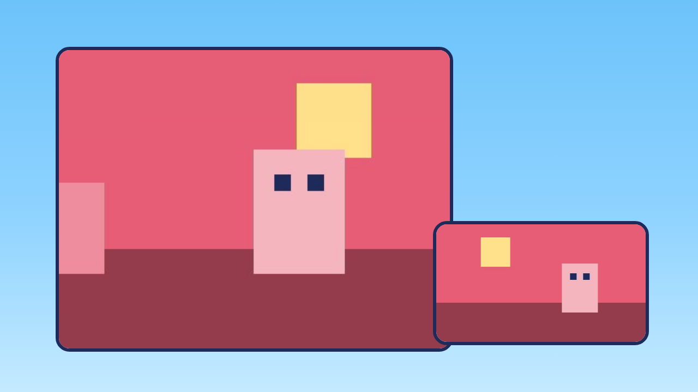
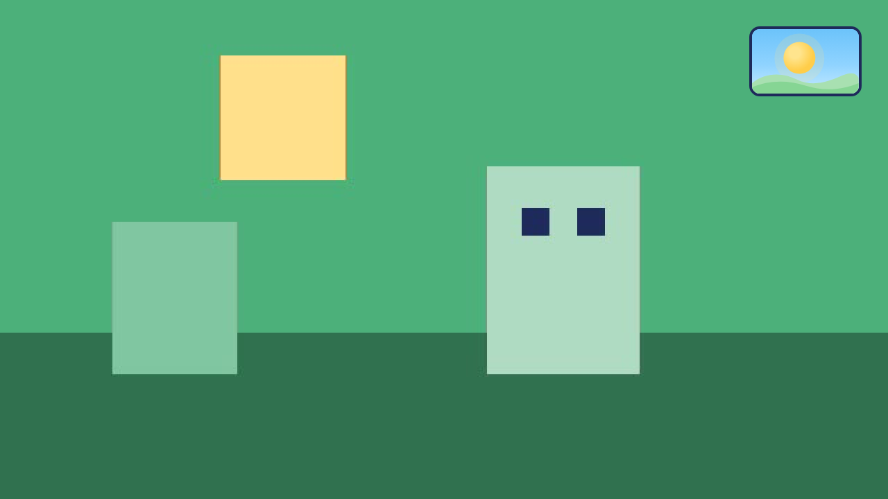
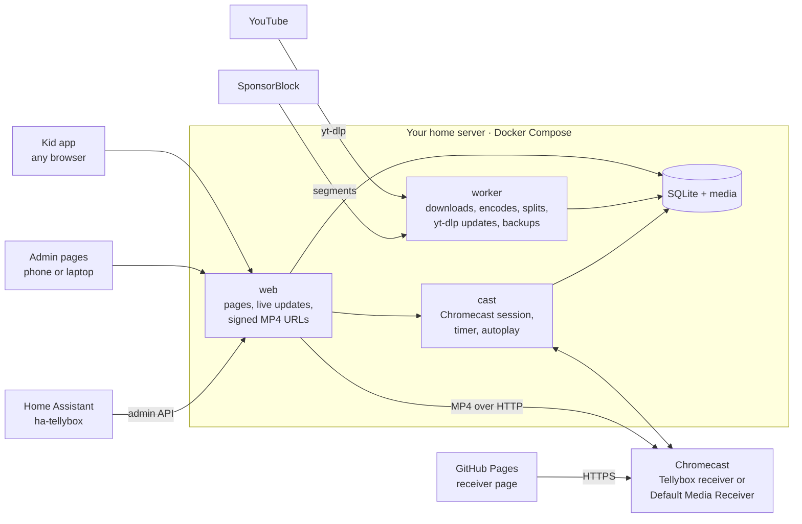

<h1 align="center">
  <picture>
    <source media="(prefers-color-scheme: dark)" srcset="docs/images/brand/logo-dark.svg">
    
  </picture>
</h1>

**A TV remote for kids who can't read yet, with only the videos you approved and a daily time limit that switches itself off.**


Casting YouTube to the TV for young kids goes wrong in predictable ways. There are ads, and there are recommendations and autoplay into videos you never picked. There is no time limit that actually holds. YouTube Kids can't be locked down while casting.

Tellybox is a small self-hosted app that replaces all of that:

- **You pick the videos.** Add a YouTube video or a whole playlist from the admin page. Tellybox downloads it to your home server, and nothing appears for the kids until you approve it.
- **Kids pick without reading.** They tap their own picture on a "who's watching?" screen, then pick from big thumbnails and show artwork on any phone, tablet or laptop. One tap starts the episode on the TV.
- **The TV only plays your files.** Tellybox casts plain MP4 files from your server to a Chromecast. The YouTube app is never involved, so there are no ads, no recommendations and no "up next" you didn't choose.
- **No sponsor reads.** Sponsor segments, self-promotion and "like and subscribe" reminders are cut out of each video when it downloads, using [SponsorBlock](https://sponsor.ajay.app/).
- **Long compilations become episodes.** A two-hour "best of" video turns into separate episodes, each with its own thumbnail and title. Tellybox finds the cuts from the video's chapters or from the show's title card, and you check them before anything is cut.
- **The day's time runs out gently.** Each kid has their own daily allowance, and the sky in the kid app is the timer: the sun sinks as the allowance runs down, and it's night when time is up. The current episode gets to finish, then the TV stops. With the optional Tellybox receiver, the TV shows the same sky in a corner and says goodnight when time is up. You can add time, give an unlimited day, or stop the TV from your phone, wherever you are.
- **It fits in your smart home.** A [Home Assistant integration](https://github.com/sandermvanvliet/ha-tellybox) shows what's on and each kid's time left, and puts the parent controls on your dashboards and automations.
- **It stays at home.** It runs in Docker on your own server and is reachable only on your network (and your Tailscale tailnet). There are no accounts, no cloud and no telemetry.

## What the kids see

<table>
  <tr>
    <td width="25%"></td>
    <td width="25%"></td>
    <td width="25%"></td>
    <td width="25%"></td>
  </tr>
  <tr>
    <td align="center"><b>Home</b><br>Continue watching, then one tile per show</td>
    <td align="center"><b>A show</b><br>Episodes in order; the one on TV is ringed</td>
    <td align="center"><b>Dusk</b><br>The last five minutes of the day</td>
    <td align="center"><b>Night</b><br>Time's up; tiles rest until tomorrow</td>
  </tr>
</table>

- **Who's watching?** Each kid picks their own picture before choosing, and several kids can watch together. With a single profile the question is skipped.
- **Nothing to read.** Everything works from thumbnails, show artwork and icons. Each episode and show also has a small title under its picture. That's for the grown-ups: when a kid explains which one they want, you can find it quickly.
- **One tap to the TV.** Tapping an episode plays it on the TV and replaces whatever was on. The bar at the bottom shows what's playing and has one pause/resume button. There's no seeking, no volume and no skipping to fight over.
- **Continue watching.** Tellybox remembers where each episode stopped and resumes there. The next episode of a show plays automatically, and you can turn that off per show.
- **Every screen stays in sync.** A pause on the tablet shows up on the phone within a second. Tellybox installs as a home-screen app.

## What the TV shows

Out of the box, episodes play through the Chromecast's standard Default Media Receiver. The optional **Tellybox receiver** is a Cast app of your own that makes the TV part of the story, still without any text:

<table>
  <tr>
    <td width="25%"></td>
    <td width="25%"></td>
    <td width="25%"></td>
    <td width="25%"></td>
  </tr>
  <tr>
    <td align="center"><b>Loading</b><br>The show's artwork while it starts</td>
    <td align="center"><b>Playing</b><br>The sky in the corner</td>
    <td align="center"><b>Up next</b><br>Before autoplay continues</td>
    <td align="center"><b>Goodnight</b><br>Time's up</td>
  </tr>
</table>

- **Loading:** the show's artwork while the episode starts, instead of a spinner.
- **The sky in the corner:** the same sun as in the kid app, sinking as the allowance runs down and turning to dusk in the last five minutes. It's hidden on an unlimited day.
- **Up next:** before autoplay continues, a card with the next episode's thumbnail.
- **Goodnight:** when time is up and the last episode has finished, a calm night scene. After 10 minutes the Chromecast goes back to its backdrop and the TV can sleep.

If the Tellybox receiver doesn't start, Tellybox tries once more before it falls back. Then the same episode plays on the Default Media Receiver, and Tellybox tries its own receiver again at the next episode. If the receiver disappears in the middle of an episode, it's started again at the same spot. Each problem is logged, and the dashboard shows the last one. Turning the receiver on takes one app ID in Settings; see the [installation guide](docs/installation.md#tellybox-receiver-optional).

## What you see

<table>
  <tr>
    <td width="33%"></td>
    <td width="33%"></td>
    <td width="33%"><br><br></td>
  </tr>
  <tr>
    <td align="center"><b>Dashboard</b><br>What's on, time left, overrides</td>
    <td align="center"><b>Add a playlist</b><br>Tick the videos, hold for approval</td>
    <td align="center"><b>Approve and review</b><br>Held downloads, viewing history</td>
  </tr>
</table>

<table>
  <tr>
    <td width="33%"></td>
    <td width="67%"></td>
  </tr>
  <tr>
    <td align="center"><b>Split a compilation</b><br>Found cuts, titles read from the title cards</td>
    <td align="center"><b>Review the cuts</b><br>The title card at every cut, how sure each one is, the channel intro left out</td>
  </tr>
</table>

The admin pages are designed for a phone first and sit behind a password. They speak English, Dutch or German, whichever the browser prefers, so each parent gets their own language without a setting.

- **Dashboard:** what's on the TV right now and how much time is used and left. It has buttons for **+15 min**, **+30 min**, **Unlimited today**, **Block today** and **Stop now**, plus the download queue.
- **Add a video or playlist:**
  - Paste a YouTube link to see a preview (title, channel, duration, thumbnail) before anything downloads.
  - A playlist lists its videos, up to 200, with a checkbox each. Videos you already have, private ones and ones not out yet are greyed out.
  - Every selected video becomes its own download job.
- **Hold for approval:** held videos download but stay invisible to the kids until you publish them, one at a time or with **Publish all ready** for a whole playlist.
- **Library:**
  - Videos are grouped into a show per YouTube channel. Shows can be renamed and merged; episodes can be renamed, reordered and moved between shows.
  - Artwork can be set from an upload or a frame of the video. Anything can be hidden without deleting it.
  - Disk use is shown per show.
- **Splitting:** turn a compilation into episodes.
  - Mark cuts in a player that steps by second or by frame, or start from the video's chapters. Name each part, and leave out what you don't want, such as a channel intro.
  - Or mark the show's title card once, and **Find cuts** proposes every cut, with the episode titles read from the cards. Each cut says how sure it is, and you can still move, add or remove cuts.
  - **Approve and cut** makes each part its own episode, in the original's place in the show. You choose whether to keep the original video so you can split it again.
  - A show can find the episodes in new long videos automatically. Those stay hidden from the kids until you've approved the split.
- **SponsorBlock:** which kinds of segments are cut, set once for everything and changeable per show. Each episode's page lists the segments that were removed and the time saved, and can download the video again with or without them.
- **Profiles:** a profile per kid with a name and a picture (one of the built-in avatars or a photo), each with their own allowance, continue watching and history.
- **Integrations:** API tokens for [Home Assistant](#home-assistant) and similar tools, read-only or with parent controls, revocable at any time.
- **Settings:** the daily allowance and how time is counted, the longest single viewing session, when the day resets, which Chromecast to use, and the Tellybox receiver's app ID.
- **History:** what was watched, by whom, when and for how long, plus the overrides applied (and whether they came from Home Assistant), for the last 21 days.

## The timer, in detail

Kids are masters of the loophole, so the rules are explicit:

| Rule | Default |
| --- | --- |
| Daily allowance | 60 minutes per kid, resets at 04:00 |
| What counts | Only time actually playing (pauses don't count). A "wall clock" mode that counts pauses is available. |
| Longest viewing session | 90 minutes of wall-clock time, even if allowance is left. Nothing playing for 15 minutes ends the session. |
| Time runs out mid-episode | The episode finishes, then the TV stops and autoplay is suppressed. |
| Finishing grace | At most 15 minutes, so an hour-long video can't run on forever. |
| Rewatching | Counts like anything else. |
| Watching together | Time counts for every kid watching, and an episode starts only if all of them have time left. |
| Parent overrides | Extra minutes, unlimited today (lifts the session limit too), block today, and stop now, for everyone or for one kid. Block and stop now take effect immediately, without grace. |
| Restarts and Wi-Fi blips | Timer state survives restarts. Time isn't counted while Tellybox can't see the TV. |
| Other apps casting | Ignored. Only playback that Tellybox started is timed or stopped. |

## Home Assistant

[**ha-tellybox**](https://github.com/sandermvanvliet/ha-tellybox) is a Home Assistant integration for Tellybox, installed through HACS. It needs Home Assistant 2026.4 or later and a Tellybox token from **Admin → Integrations**.

- **A Tellybox device:** a media player with what's on, sensors for the time left and downloads awaiting approval, and buttons for stop now, extra time, unlimited today and block today.
- **A device per kid:** time left and used today, whether they're watching, and their own override buttons.
- **Actions** for automations: a spoken "five more minutes", the TV off when time is up, a bedtime block, or chores that earn extra minutes.

It never becomes a way around the timer: every action goes through Tellybox, and playing from Home Assistant is refused when a kid is out of time. The API it uses is documented in [docs/admin-api.md](docs/admin-api.md), and the Python client is [pytellybox](https://github.com/sandermvanvliet/pytellybox).

## How it works



- **Downloads:** videos are fetched with [yt-dlp](https://github.com/yt-dlp/yt-dlp) at up to 720p and stored as H.264/AAC MP4 with fast start.
  - When YouTube already serves H.264, the file is only remuxed, which takes seconds. Otherwise it's encoded with x264 at low priority; no GPU is needed.
  - yt-dlp updates itself every night, or from a button on the Jobs page, without rebuilding the image.
- **SponsorBlock:** yt-dlp cuts the chosen segments out of the file during the download. It cuts on keyframes without re-encoding, so it adds almost no time. The lookup sends only a short hash prefix of the video id.
  - SponsorBlock's data is crowd-sourced and grows after a video comes out, so Tellybox checks each new video again every night for 7 days. If new segments appear, it replaces the file and moves saved positions so "continue watching" resumes at the same moment.
  - If SponsorBlock can't be reached, the video downloads uncut rather than not at all.
- **Splitting:** each part is re-encoded on its own, so it starts and ends on the exact frame.
  - Finding cuts samples two frames a second and compares the marked part of the title card by its [dHash](https://www.hackerfactor.com/blog/index.php?/archives/529-Kind-of-Like-That.html) fingerprint. The episode length you give helps it drop false matches and look again where a card was missed.
  - Each cut moves back to the black or the scene change just before the card, found with ffmpeg. [Tesseract](https://github.com/tesseract-ocr/tesseract) reads the title.
  - A 30-minute 720p video takes about 80 seconds on the CPU.
- **Casting:** the Chromecast plays the files straight from your server, through the Tellybox receiver or the standard Default Media Receiver. Both work on the original 2013 Chromecast; a tap typically reaches the TV in about 4 seconds, and under a second when the receiver is already running.
- **The Tellybox receiver:** a static HTML page on the Cast Application Framework, hosted on GitHub Pages (or your own HTTPS host). The cast service sends it the timer state over a custom Cast channel. The page holds no household data, and the videos and images still come from your server over the LAN.
- **Media links:** the links given to the Chromecast are HMAC-signed and expire after 24 hours, because a Chromecast can't log in.
- **Timer:** one service owns the Chromecast connection and the timer. It pushes every state change to all open pages, and to Home Assistant, over Server-Sent Events.
- **Storage:** everything lives in one SQLite file plus a media folder, so a backup is a single file. A built-in `tellybox backup` command makes a consistent copy while everything keeps running.

**Stack:** Python 3.12, FastAPI, pychromecast, yt-dlp, ffmpeg and SQLite, plus OpenCV and Tesseract for splitting. The frontend and the TV receiver are vanilla JavaScript and CSS with no build step, and the admin pages are server-rendered Jinja templates.

## Get started

You need:
- a Linux machine with Docker that stays on (a home server, NAS or mini PC);
- a Chromecast on the same network;
- about 0.5 to 1 GB of disk per hour of video.

The **[installation and deployment guide](docs/installation.md)** walks through the setup:
- the compose file, the settings and the first-run admin password;
- first-run setup and HTTPS behind a reverse proxy;
- remote access over Tailscale;
- backups, updates and troubleshooting.

The short version:

```sh
mkdir -p /opt/tellybox && cd /opt/tellybox
curl -fsSLO https://github.com/sandermvanvliet/Tellybox/releases/latest/download/docker-compose.yml
curl -fsSL https://github.com/sandermvanvliet/Tellybox/releases/latest/download/env.example -o .env
nano .env                                          # set TZ to your time zone
docker compose up -d
docker compose logs tellybox | grep "setup code"
# open http://<server-ip>:8080/admin/setup with that code to choose a password,
# and http://<server-ip>:8080 for the kids
```

## Roadmap

Tellybox is used daily by one family. What's done and what's next:

- [x] Kid picker, casting, the timer with grace and overrides, and continue watching with autoplay
- [x] Adding videos and playlists, hold for approval, library management, history
- [x] Docker deployment with CI, nightly backups and self-updating yt-dlp
- [x] English, Dutch and German, chosen per browser
- [x] **Profiles per kid:** a "who's watching?" screen with a picture per kid, and an allowance and history for each
- [x] **Home Assistant:** an admin API with tokens, and the [ha-tellybox](https://github.com/sandermvanvliet/ha-tellybox) integration
- [x] **No sponsor segments:** sponsor parts, self-promotion and "like and subscribe" reminders are cut out of the file at download, using [SponsorBlock](https://github.com/ajayyy/SponsorBlock)
- [x] **Tellybox on the TV itself:** its own Cast receiver shows the sinking sun in a corner, a goodnight screen when time is up, show artwork while loading, and an up-next card. The standard receiver stays as a fallback.
- [x] **Episode splitting:** cut long compilation videos into single episodes, by hand, from YouTube chapters, or found automatically from the show's title card
- [x] **A sturdier TV receiver:** it retries before falling back, comes back at the next episode, recovers mid-episode, and logs every problem
- [ ] **Channel subscriptions:** new uploads from a channel land in an approval inbox

The full product requirements are in [docs/PRD.md](docs/PRD.md), and the build log is in [docs/PROGRESS.md](docs/PROGRESS.md).

## Development

```sh
python3.12 -m venv .venv && .venv/bin/pip install -e '.[dev]'
.venv/bin/pytest -q                                          # ~1400 tests, no network or Chromecast needed
.venv/bin/python scripts/kid_mock_server.py --port 8099      # the kid app against a mock API, every state scriptable
```

The timer and cast controller are tested with a fake clock and a fake Chromecast. [docs/kid-api.md](docs/kid-api.md) describes the kid app's API, [docs/admin-api.md](docs/admin-api.md) the admin API for Home Assistant, [docs/cast-api.md](docs/cast-api.md) the internal API of the cast service, and [docs/receiver-protocol.md](docs/receiver-protocol.md) the messages between the cast service and the TV receiver. With the web service running, `/receiver/dev.html` shows the receiver's screens in a desktop browser, driven by buttons instead of a Chromecast.

The logo, favicon and home-screen icon are SVGs in [docs/images/brand/](docs/images/brand/) and `tellybox/web/static/`. After changing one, run `scripts/brand.sh` to regenerate the outlined logos, the social preview and the PNG and ICO files, and the receiver's copy of the favicon. It needs Inkscape, ImageMagick and the [Fredoka](https://fonts.google.com/specimen/Fredoka) font.

## License

Copyright © 2026 Sander van Vliet.

Tellybox is free software: you can redistribute it and/or modify it under the terms of the [GNU General Public License](LICENSE) as published by the Free Software Foundation, either version 3 of the License, or (at your option) any later version. It is distributed in the hope that it will be useful, but without any warranty; see the license for details.

## A note on YouTube

Tellybox downloads videos for private viewing at home. Doing that may conflict with YouTube's Terms of Service. Use it for your own household only, and don't redistribute what you download. Tellybox is not affiliated with YouTube or Google. The screenshots use invented shows and generated artwork.
