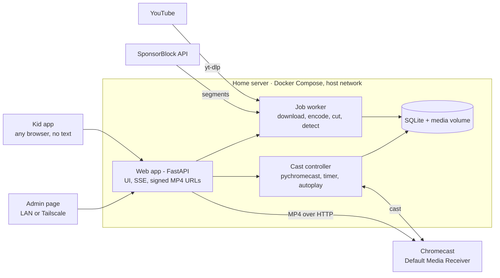

# Tellybox — Product Requirements

_Sep 27, 2026 · Sander · updated Sep 28, 2026 (playlists CI-7, episode and show titles KA-10, interface languages NF-13, SponsorBlock SB-1..6, Cast receiver CR-1..8, phases reordered; Sep 30, 2026: receiver app published, CR-1)_

## Overview

Tellybox is a self-hosted web app that lets young children pick parent-approved videos from any device and play them on the TV through a Chromecast, within a daily time allowance the parent controls.

**Problem.** YouTube Kids does not support casting in locked kiosk mode. Casting through the regular YouTube app exposes ads, recommendations and autoplay of unapproved content, and offers no reliable watch-time limit.

**Solution.** The parent adds YouTube videos, playlists or channels on an admin page. The home server downloads approved videos, cuts out sponsor segments using SponsorBlock, optionally splits long compilations into episodes, and serves them on the LAN. Kids choose from a thumbnail-only picker, and the server casts the file to the Chromecast's Default Media Receiver. A timer service tracks watch time per kid and stops playback when the allowance runs out.

### Goals

1. Kids who cannot read can independently choose and start approved content.
2. Nothing plays on the TV that the parent has not explicitly approved: no ads, no sponsor segments, no recommendations, no YouTube app.
3. Each kid's daily viewing time is limited, with parent overrides available from anywhere via Tailscale.
4. Long compilation videos become individual episodes with little manual effort.

### Non-goals

1. Content sources other than YouTube.
2. Policing casts started from other apps or devices.
3. Multiple Chromecasts or multi-room playback.
4. Public internet exposure; access is LAN plus Tailscale only.
5. A custom Cast receiver app before v7; the Default Media Receiver stays the fallback even then (CR-6).

## Users and environment

There are two roles: kids, who pick and watch, and a single admin (the parent), who curates content and sets limits.

| Role | Count | Needs | Constraints |
| --- | --- | --- | --- |
| Kid | 2+ (one profile each) | Pick a video, pause/resume, see time left | Cannot read; icon and thumbnail UI only |
| Admin | 1 | Add content, split episodes, set allowances, override the timer, view history | Uses LAN or Tailscale; password login |

### Environment

| Component | Details |
| --- | --- |
| TV receiver | One original Chromecast (no remote). Plays H.264 up to 1080p with AAC audio. |
| TV | Older model; 720p output is sufficient. |
| Kid devices | Any phone, tablet or browser on the home network; no kiosk lock required. |
| Server | Recent Ubuntu, Docker and Docker Compose, CPU-only (no usable GPU). |
| Network | Server and Chromecast on the same LAN segment, so mDNS discovery works. Tailscale provides remote admin access. |
| Deployment | Docker Compose, following the owner's existing deploy-flow repository for this server. |

## Functional requirements: kids, playback and timer

Requirement IDs are referenced in the release plan. Priority: **Must** = required for its release, **Should** = expected but can slip, **Could** = nice to have.

### Profiles

| ID | Requirement | Priority | Release |
| --- | --- | --- | --- |
| PR-1 | Admin creates a profile per kid with a name and a picture (avatar or photo) used for selection. | Must | v2 |
| PR-2 | The kid page starts with a "who's watching" screen showing profile pictures only. More than one profile can be selected for watching together. | Must | v2 |
| PR-3 | Each profile has its own daily allowance, usage, continue-watching list and history. | Must | v2 |
| PR-4 | When several profiles watch together, watch time is deducted from each of them, and playback is allowed only while all have time left. | Should | v2 |

In v1, before profiles exist, a single household profile holds one shared allowance. The data model includes profiles from the start, so v2 needs no migration of history.

Profiles separate time, history and continue watching; every profile sees the whole approved library (A-8). There is no PIN: a kid who picks a sibling's picture uses the sibling's time, an accepted risk (A-7).

### Kid app

| ID | Requirement | Priority | Release |
| --- | --- | --- | --- |
| KA-1 | Web app usable on any phone, tablet or desktop browser on the LAN; responsive, touch-first, large tap targets. | Must | v1 |
| KA-2 | No text is required to use the app: navigation uses thumbnails, show artwork and icons only. The short episode and show titles of KA-10 are an aid for adults; nothing depends on reading them. | Must | v1 |
| KA-3 | Home screen shows a "continue watching" row, then one tile per show (channel). Tapping a show opens its episode grid in episode order. | Must | v1 |
| KA-4 | Only approved episodes are visible. The kid app has no search, URL entry, or link to the admin page. | Must | v1 |
| KA-5 | Tapping an episode casts it to the TV. If something is already playing, the new pick replaces it. | Must | v1 |
| KA-6 | A now-playing bar shows the current episode thumbnail and a single pause/resume button. No seek, volume or skip controls. | Must | v1 |
| KA-7 | All open kid pages reflect the TV's current state live (playing, paused, time's up) within 2 seconds. | Should | v1 |
| KA-8 | Remaining time is shown visually (e.g. a shrinking bar or icons), with a visible change in the last 5 minutes. | Could | v1 |
| KA-9 | When the allowance is used up, the app shows a friendly "time's up" screen and picks are disabled until tomorrow or a parent override. | Must | v1 |
| KA-10 | Episode tiles (episode grid and continue watching) show the episode title in small print below the thumbnail, and show tiles show the show's name below the artwork, cut off after two lines. It helps a parent find the video a kid is describing. The picture stays the main element. The admin shortens a long title by renaming the episode or show (LM-1). | Should | v1 |

### Playback and casting

| ID | Requirement | Priority | Release |
| --- | --- | --- | --- |
| PB-1 | The server discovers the Chromecast via mDNS and remembers it; the admin can choose it if several are found. | Must | v1 |
| PB-2 | Episodes are cast as MP4 files served over HTTP from the server to the Chromecast's Default Media Receiver; from v7, to the Tellybox receiver, with the Default Media Receiver as fallback (CR-1, CR-6). The YouTube app is never used. | Must | v1 |
| PB-3 | When an episode ends, the next episode of the same show plays automatically, unless time has run out or autoplay is turned off for that show. | Must | v1 |
| PB-4 | Playback position is saved per profile, so "continue watching" resumes where the kid left off. An episode counts as finished at 95% played. | Should | v1 |
| PB-5 | If the Chromecast disconnects or another app takes over, the server records the session as ended and the kid page shows the stopped state. | Must | v1 |

### Watch timer

| ID | Requirement | Priority | Release |
| --- | --- | --- | --- |
| WT-1 | Each profile has a daily allowance in minutes, reset at a configurable time (default 04:00 local). | Must | v1 |
| WT-2 | Counting mode is configurable: **ignore pauses** (only playing time counts) or **wall clock** (time counts from play until stop, pauses included). | Must | v1 |
| WT-3 | With "ignore pauses", a maximum wall-clock session length applies (e.g. 90 min). When it's reached, the session ends even if play-time allowance remains. | Must | v1 |
| WT-4 | When the allowance runs out mid-episode, the current episode finishes, then playback stops and autoplay is suppressed. | Must | v1 |
| WT-5 | The finish-the-episode grace is capped (default 15 min) so an unsplit long video cannot run on indefinitely. | Must | v1 |
| WT-6 | Rewatching counts toward the allowance like any other viewing. | Must | v1 |
| WT-7 | Parent overrides from the admin page: grant extra minutes today, set unlimited for today, block viewing for today, and stop playback now. | Must | v1 |
| WT-8 | Timer state survives server restarts; usage is persisted at least every 30 seconds. | Must | v1 |
| WT-9 | Only playback started through Tellybox is timed and controlled; other casts to the Chromecast are ignored. | Must | v1 |

### Tellybox receiver on the TV

The Default Media Receiver only plays a file and shows its own spinner and backdrop. Tellybox's own Cast receiver adds the kid app's picture language to the TV itself. It shows no text: kids can't read (KA-2).

| ID | Requirement | Priority | Release |
| --- | --- | --- | --- |
| CR-1 | Tellybox has its own Cast Web Receiver. It is published in the Google Cast SDK Developer Console, so it runs on any Chromecast without registering the device; the receiver page is served over HTTPS and contains no household data. It plays the same signed MP4 files as today. | Must | v7 |
| CR-2 | During playback, a small sky in a corner of the TV shows the time left, in the same states as the kid app: the sun sinks, and it's dusk in the last 5 minutes. There's no text and no numbers. It's hidden on an unlimited day. | Must | v7 |
| CR-3 | When the allowance runs out (or on block or stop now) and the episode has ended, the TV shows a night scene instead of the Chromecast backdrop. After 10 minutes the cast session closes, so the TV can go to sleep. | Must | v7 |
| CR-4 | While an episode loads, and between autoplay episodes, the TV shows the show's artwork and the episode's thumbnail instead of a spinner. | Should | v7 |
| CR-5 | In the last seconds before autoplay continues, an up-next card shows the next episode's thumbnail. It isn't shown when time is up, when autoplay is off for the show, or at the end of a show. | Should | v7 |
| CR-6 | If the Tellybox receiver can't launch or load within a few seconds, the cast service falls back to the Default Media Receiver automatically. Timing, control and recognising our own playback (WT-9) work the same with either. | Must | v7 |
| CR-7 | The receiver gets its state (time left, time's up, next episode) from the cast service through a custom Cast message namespace, over the connection the cast service already holds. Apart from loading media and images, it makes no network calls of its own. | Must | v7 |
| CR-8 | On the 1st-gen Chromecast, the overlays don't cause dropped frames or rebuffering in 720p playback. | Must | v7 |

## Functional requirements: admin, content and splitting

The admin page is the only place content enters the system. Nothing reaches the kid app without explicit approval.

### Content ingest

| ID | Requirement | Priority | Release |
| --- | --- | --- | --- |
| CI-1 | Admin pastes a single YouTube video URL; the server fetches its metadata and shows title, channel, duration and thumbnail before download. | Must | v1 |
| CI-2 | Downloads use yt-dlp at a maximum of 720p. Output is MP4 with H.264 video and AAC audio and the faststart flag. Existing H.264 streams are remuxed rather than re-encoded where possible. | Must | v1 |
| CI-3 | Downloads and encodes run as background jobs with visible status (queued, downloading, processing, ready, failed) and a retry action. | Must | v1 |
| CI-4 | By default, videos are grouped into a show named after the YouTube channel. The admin can create, rename and merge shows. | Must | v1 |
| CI-5 | yt-dlp can be updated without rebuilding the app, either automatically on a schedule or from an admin button. | Should | v1 |
| CI-6 | The admin page shows disk usage per show and in total, and the admin can delete a show or episode with its files. | Should | v1 |
| CI-7 | Admin pastes a YouTube playlist URL. The preview lists the playlist's videos with thumbnail, title and duration, and marks videos that are already in the library or unavailable. On confirm, the server creates one download job per remaining video. Each video joins its own channel's show (CI-4). By default the videos are held for approval: they download, but reach the kid app only when the admin publishes them. The add form has a "hold for approval" option, ticked by default for playlists, that the admin can untick. A URL with both a video and a playlist (`watch?v=…&list=…`) asks whether the video or the whole playlist is meant. Channel URLs are not playlists; they stay with subscriptions (CS-1). | Must | v1 |

### SponsorBlock

Sponsor segments are cut out of the file when it's downloaded, using the community database of [SponsorBlock](https://github.com/ajayyy/SponsorBlock). Nothing is skipped during playback: the Default Media Receiver plays a file that simply doesn't contain them.

| ID | Requirement | Priority | Release |
| --- | --- | --- | --- |
| SB-1 | When a video is downloaded, its SponsorBlock segments in the enabled categories are removed from the file (yt-dlp's SponsorBlock support). The lookup sends only a hashed prefix of the video ID. Chapters (ES-1) are shifted to match. | Must | v3 |
| SB-2 | The enabled categories are set in Settings; the default is sponsor, self-promotion and interaction reminders. A show can turn SponsorBlock off or choose its own categories. A change applies to new downloads and to videos still inside their re-check window (SB-3). | Must | v3 |
| SB-3 | For 7 days after a download, the worker checks SponsorBlock daily. If new or changed segments appear in the enabled categories, it downloads the video again with them removed and replaces the file atomically (NF-8). The episode keeps its ID, title, thumbnail, show and hidden state, and saved playback positions are moved back by the time removed before them. | Must | v3 |
| SB-4 | An episode's admin page lists the removed segments (category, original start and end) and the total time removed. It offers "Download again without SponsorBlock" for when a cut removed real content. | Should | v3 |
| SB-5 | If SponsorBlock can't be reached, the download goes ahead uncut, and the re-check window (SB-3) catches up. SponsorBlock never makes a download fail. | Must | v3 |
| SB-6 | Re-checks stop once a video has been split into episodes (ES-8), because the cut points refer to that file. | Must | v5 |

### Channel subscriptions

| ID | Requirement | Priority | Release |
| --- | --- | --- | --- |
| CS-1 | Admin pastes a YouTube channel URL to subscribe. Existing uploads are listed for selection; they are not downloaded automatically. | Must | v4 |
| CS-2 | The server checks subscribed channels for new uploads on a schedule (default every 6 hours). | Must | v4 |
| CS-3 | New uploads go to an approval inbox showing thumbnail, title and duration. Only approved items are downloaded. There is no automatic approval, not even per channel (A-9). | Must | v4 |
| CS-4 | Subscriptions can be paused or removed without deleting downloaded content. | Should | v4 |

### Library management

| ID | Requirement | Priority | Release |
| --- | --- | --- | --- |
| LM-1 | Admin can rename shows and episodes, reorder episodes, and move episodes between shows. | Must | v1 |
| LM-2 | Admin can set a show's artwork and an episode's thumbnail, by uploading an image or picking a frame from the video. | Should | v1 |
| LM-3 | Admin can hide or unhide shows and episodes from the kid app without deleting them. | Must | v1 |
| LM-4 | Per-show settings: autoplay on or off, and the show's splitting profile (see below). | Must | v1 |

### Episode splitting

Every split is proposed first and must be reviewed and approved by the admin before episodes are published.

| ID | Requirement | Priority | Release |
| --- | --- | --- | --- |
| ES-1 | If the YouTube video has chapters, they are offered as proposed split points with their titles. | Should | v5 |
| ES-2 | Manual splitting: in a scrub-able player, the admin marks cut points and names each resulting episode. | Must | v5 |
| ES-3 | Title-card marking: the admin scrubs to a title screen, selects it and optionally draws a region to compare (e.g. the logo area). The marking is saved to the show's splitting profile. | Must | v6 |
| ES-4 | Title-card detection: using the show's profile, the server samples frames (about 2 fps) and proposes a cut wherever a title card appears. | Must | v6 |
| ES-5 | Episode-length hint: the admin enters an approximate episode length. Detection uses it to reject hits too close together, and to search harder near expected boundaries when a title card is missed. | Must | v6 |
| ES-6 | Cut placement: each cut snaps to the nearest scene change or black frame shortly before the title card, if one is found within a configurable window (default 30 s). Otherwise it falls back to the title card itself. | Should | v6 |
| ES-7 | Review screen: a thumbnail strip at each proposed cut with the start frame and timestamp. The admin can nudge, add or delete cuts, rename episodes and approve. | Must | v5 |
| ES-8 | On approval, episodes are cut frame-accurately (re-encoded) into separate files, and the source file is optionally deleted. | Must | v5 |
| ES-9 | OCR reads the episode title from the title card to prefill episode names. | Could | v6 |
| ES-10 | New compilations for a show with a saved profile are detected automatically after download and wait in the review queue. | Should | v6 |

### Admin, settings and history

| ID | Requirement | Priority | Release |
| --- | --- | --- | --- |
| AD-1 | Admin pages require a password; sessions expire after 30 days of inactivity. | Must | v1 |
| AD-2 | Settings page: allowance per profile, counting mode, maximum session length, reset time, grace cap and selected Chromecast. | Must | v1 |
| AD-3 | Dashboard: now playing, time used and remaining per profile, override buttons (WT-7) and job status. It must be usable on a phone. | Must | v1 |
| AD-4 | Viewing history per profile: episode, start and end time, minutes counted, and overrides applied. | Must | v1 |
| AD-5 | History older than 21 days is purged automatically. | Must | v1 |

### Admin API (Home Assistant)

A token-authenticated JSON API lets a home-automation system (first Home Assistant) show Tellybox's live state and apply the parent overrides. It never becomes a way around the timer. Contract: `docs/admin-api.md`.

| ID | Requirement | Priority | Release |
| --- | --- | --- | --- |
| HA-1 | The admin creates, names and revokes long-lived API tokens with a `read` or `read + control` scope; a token is shown once and only its hash is stored. | Must | v2.1 |
| HA-2 | With a read token, the admin state is available as JSON in absolute units: now playing, per-profile allowance, extra, used and remaining time, session and grace, time up, TV reachability, job counts and disk use. | Must | v2.1 |
| HA-3 | The same state streams as server-sent events on every change, with a keepalive. | Must | v2.1 |
| HA-4 | With a control token, the overrides of WT-7 (extra minutes, unlimited today, block today, stop now) can be applied for everyone or for chosen profiles, through the same code path as the admin dashboard. | Must | v2.1 |
| HA-5 | Today's unlimited and block can be cleared through the API; extra minutes stay. | Should | v2.1 |
| HA-6 | Each installation has a stable instance id; an unauthenticated info endpoint gives the instance id, version and capabilities. | Must | v2.1 |
| HA-7 | Overrides applied through the API are recorded with the token's name, and the history shows it. | Should | v2.1 |
| HA-8 | Every API action goes through Tellybox's cast service; the API offers no way to cast directly or to start playback when time is up. | Must | v2.1 |

## Non-functional requirements

The system must run unattended on a CPU-only home server and recover on its own from restarts and network blips.

| ID | Area | Requirement |
| --- | --- | --- |
| NF-1 | Security | The kid app is reachable on the LAN and via Tailscale without login, but exposes only approved content and playback of it. |
| NF-2 | Security | Admin endpoints are authenticated server-side; the admin password is stored as a salted hash (argon2 or bcrypt). |
| NF-3 | Security | Media file URLs given to the Chromecast are unguessable and expire (signed tokens), because the Chromecast cannot authenticate. |
| NF-4 | Security | Nothing is exposed to the public internet; no ports are forwarded. |
| NF-5 | Performance | A tap in the kid app starts playback on the TV within 5 seconds. |
| NF-6 | Performance | On CPU only, a 720p encode runs at least as fast as real time (x264 `veryfast` preset or similar), and title-card detection takes under half the video's duration. |
| NF-7 | Reliability | After a restart, the server reconnects to the Chromecast, restores timer state and resumes queued jobs within 60 seconds. |
| NF-8 | Reliability | Failed downloads or encodes never publish partial files; they can be retried from the admin page. |
| NF-9 | Storage | Media, database and config live on mounted volumes. A single SQLite file holds all state, so backup means copying one file. |
| NF-10 | Deployment | Ships as a Docker Compose stack using host networking (required for mDNS discovery), deployed through the owner's existing deploy-flow repository. |
| NF-11 | Operations | Structured logs to stdout. Admin dashboard shows job failures and Chromecast connection status. |
| NF-12 | Usability | Admin pages work on a phone screen. Kid pages work on screens from 4.7" phones to desktop. |
| NF-13 | Usability | The interface is in English, Dutch or German, chosen per browser from its language preferences (Accept-Language, `navigator.languages`), with English as the fallback. It covers all admin text and the kid app's screen-reader labels; content titles are not translated. |

## Architecture and data model

One Docker Compose stack on the home server runs three services that share a SQLite database and a media volume. The Chromecast only ever pulls MP4 files from the server; it never talks to YouTube.

The cast controller is the single owner of the Chromecast connection and the timer. The web app sends it commands (play, pause, override), and it pushes state changes back to all open pages.

**Stack.** Python 3 with FastAPI, pychromecast, yt-dlp, ffmpeg (including its scene and black-frame detection), OpenCV and imagehash; Tesseract optional for OCR. Frontend is a lightweight server-rendered or small SPA app, installable as a home-screen web app.

### Data model

| Entity | Key fields | Notes |
| --- | --- | --- |
| Profile | name, picture, daily allowance, counting mode | v1 has one household profile |
| Show | name, artwork, autoplay, sort order, splitting profile, SponsorBlock categories | Defaults to one per YouTube channel; categories not set = the global setting, none = SponsorBlock off for the show (SB-2) |
| SourceVideo | YouTube ID, channel, title, duration, file path, status, removed segments, SponsorBlock re-check until | The downloaded original; may be deleted after splitting |
| Episode | show, source video, start/end offset, title, thumbnail, file path, order, hidden | What kids see and play |
| SplitProfile | reference frames, compare region, match threshold, length hint, snap window | One per show |
| SplitProposal | source video, proposed cuts, status | Waits for admin review |
| Job | type, target, status, progress, error, attempts | Download, encode, detect, cut |
| Subscription | channel ID, last checked, paused | v4 |
| InboxItem | subscription, YouTube ID, metadata, decision | v4 approval inbox |
| WatchSession | profiles, episode, started, ended, seconds counted | History; purged after 21 days |
| DailyUsage | profile, date, seconds used, extra minutes, blocked | Timer state |
| PlaybackPosition | profile, episode, position, finished | Continue watching |

## Release plan

v1 delivers a complete, usable loop for the whole family; it shipped on 2026-09-28, including playlists, titles on tiles and interface languages. The owner reordered what follows on 2026-09-28: per-kid profiles first, then SponsorBlock, channel subscriptions, manual splitting, smart splitting, and finally Tellybox's own Cast receiver. On 2026-09-29 the owner moved the receiver (v7) ahead of v3–v6. Each requirement's release is listed in its table above.

| Phase | Scope | Gate to next phase |
| --- | --- | --- |
| v1 · Core loop | Kid picker (one profile), cast MP4, timer with grace cap and overrides, add by URL or playlist, download and encode, history with 21-day purge, English/Dutch/German | Shipped 2026-09-28 |
| v2 · Kid profiles | "Who's watching" screen, per-kid allowance, usage, continue watching and history, watching together (PR-1..4) | Real-device checks pass; a week of daily use |
| v2.1 · Admin API | API tokens, admin state and events, overrides over JSON, instance id: the Tellybox side of a Home Assistant integration (HA-1..8) | Running at home for a week before the integration builds on it |
| v3 · SponsorBlock | Cut sponsor segments at download, categories per show, 7-day re-check (SB-1..5) | Real-device checks pass |
| v4 · Channel subscriptions | Subscribe to a channel, scheduled checks, approval inbox (CS-1..4) | Real-device checks pass |
| v5 · Manual splitting | Scrub player, cut marking, chapter import, review screen, frame-accurate cutting (ES-1, ES-2, ES-7, ES-8, SB-6) | Real-device checks pass |
| v6 · Smart splitting | Title-card marking and detection, length hint, scene snap, OCR titles, automatic detection for new compilations (ES-3..6, ES-9, ES-10) | Detection accepted on 2 shows |
| v7 · Tellybox receiver | Own Cast receiver: time left on the TV, time's-up screen, loading and idle screens, up-next card, automatic fallback to the Default Media Receiver (CR-1..8) | Real-device checks pass on the 1st-gen Chromecast |

### v1 build order

1. **Casting spike.** Discover the Chromecast from a container with host networking and cast a local MP4 served over HTTP; confirm pause, resume and status events.
2. **Cast controller and timer.** Persistent session, play-time accounting in both counting modes, grace cap, session maximum, overrides, restart recovery.
3. **Ingest pipeline.** yt-dlp download at 720p, remux or encode to H.264/AAC, job queue with status and retries.
4. **Kid app.** Show grid, continue watching, episode grid, now-playing bar, time's-up screen, live updates.
5. **Admin pages.** Login, add by URL, library management, settings, dashboard with overrides, history.
6. **Deployment.** Compose file and integration with the existing deploy-flow repository; volume and backup setup. (Moved ahead of splitting by the owner, 2026-09-28: deploy before adding features.)
7. **Playlists and episode titles.** Add a playlist as one job per video, held for approval by default (CI-7); short episode titles on the kid app's episode tiles (KA-10). (Added by the owner, 2026-09-28, ahead of splitting.)

### Build order after v1

One step per branch or PR, each proposed as a plan first and closed with real-device checks.

8. **Kid profiles (v2).** Profile management, "who's watching" screen, per-profile timer and history, watching together.
9. **Admin API for Home Assistant (v2.1).** API tokens, the admin state and its event stream, override endpoints, instance id and `/api/info` (HA-1..HA-8). Phase 0 of the owner's Home Assistant integration plan; the integration itself lives in separate repositories. (Inserted by the owner, 2026-09-29. Plan: `docs/plans/step9-ha-api.md`.)
10. **SponsorBlock (v3).** Cutting at download, settings and per-show categories, the 7-day re-check with position adjustment, removed-segment overview.
11. **Channel subscriptions (v4).** Subscribe, list existing uploads, scheduled checks, approval inbox, pause and remove.
12. **Manual splitting (v5).** Scrub player, cut marking, chapter import, review screen, frame-accurate cutting.
13. **Tellybox receiver (v7).** It starts with a spike on the real 1st-gen Chromecast: registration, where the receiver is hosted, and overlay performance. Then come the fallback, the time-left sky, the time's-up screen, the loading screens and the up-next card. (Moved ahead of SponsorBlock, subscriptions and splitting by the owner, 2026-09-29: the TV is where the kids look. Plan: `docs/plans/step13-receiver.md`.)
14. **Smart splitting (v6).** Title-card marking and detection, length hint, scene snap, OCR titles, automatic detection. (Renumbered from 12 when the admin API was inserted as step 9 and the receiver kept 13, 2026-09-29.)

## Risks, assumptions and open questions

The biggest risks are external: YouTube changes that break yt-dlp, and the ageing original Chromecast. Both are cheap to test early in the v1 casting spike.

### Risks

| Risk | Impact | Mitigation |
| --- | --- | --- |
| YouTube changes break yt-dlp downloads | New content can't be added; existing library unaffected | Update yt-dlp without rebuilding (CI-5); retry failed jobs |
| Downloading may conflict with YouTube's terms of service | Policy risk for the owner | Personal household use only, no redistribution; owner accepts the risk |
| The original Chromecast no longer receives Google software updates | Casting behaviour could change or break | Use only the standard Default Media Receiver; verify in step 1 of v1 |
| CPU-only encoding of long compilations is slow | Content availability delayed by hours | Remux when possible, x264 `veryfast`, low-priority background jobs |
| The kid app has no login, so a kid can pick a sibling's profile | One kid uses another's allowance | Accepted: no PIN (A-7). Revisit if it's abused. |
| SponsorBlock segments are community-submitted and can be wrong | Real content is cut out | Only sponsor, self-promotion and interaction by default; per-show opt-out; the removed segments are visible, with "Download again without SponsorBlock" (SB-2, SB-4) |
| Segments are submitted after the download | Sponsor parts stay in the file | Daily re-check for 7 days (SB-3) |
| Title-card detection accuracy varies per show | Wrong or missed cuts | Mandatory review (ES-7), manual cuts as fallback, per-show tuning |
| mDNS discovery fails inside Docker | Chromecast not found | Host networking (NF-10); manual IP entry as fallback |
| The Chromecast loads a custom receiver from an HTTPS URL, but it can't resolve internal names (it uses its own DNS) | The receiver can't be hosted on the home server as-is | Spike first in v7. Options: a public static host for the receiver's HTML and JS, which contain no household data (media still comes from the LAN), or a public DNS name with a valid certificate that points at the LAN. Decide in the spike (open question). |
| An HTTPS receiver page loads media over plain HTTP from the LAN | Mixed-content blocking on the receiver | Test in the v7 spike; serve media over HTTPS on the LAN if needed |
| Overlays are too heavy for the 1st-gen Chromecast | Stutter during playback | Keep overlays static, CSS-only and small (CR-8); measure in the spike |
| Google changes the Cast SDK or the developer-console rules | The receiver stops loading | Automatic fallback to the Default Media Receiver (CR-6) |

### Assumptions

| ID | Assumption |
| --- | --- |
| A-1 | Watching together deducts time from every selected profile (PR-4). |
| A-2 | "Ignore pauses" counts only playing time, capped by a maximum wall-clock session length (WT-2, WT-3). |
| A-3 | The daily allowance resets at 04:00 local time. |
| A-4 | The finish-the-episode grace is capped at 15 minutes. |
| A-5 | A new pick in the kid app replaces what is playing, rather than being queued. |
| A-6 | Removing a subscription keeps its downloaded episodes. |
| A-7 | Kid profiles have no PIN or other protection (owner, 2026-09-28). |
| A-8 | Every profile sees the whole approved library; profiles separate time, history and continue watching only (owner, 2026-09-28). |
| A-9 | Subscription uploads always go through the approval inbox; there is no auto-approve (owner, 2026-09-28). |
| A-10 | SponsorBlock segments are removed from the file at download rather than skipped during playback; default categories are sponsor, self-promotion and interaction reminders (owner, 2026-09-28). |
| A-11 | The Tellybox receiver (v7) covers time left on the TV, the time's-up screen, loading and idle screens and the up-next card; the Default Media Receiver stays as an automatic fallback (owner, 2026-09-28). |
| A-12 | Each device remembers who's watching; it asks again after the daily reset or 30 minutes without use, and an avatar button switches kids at any time (owner, 2026-09-29). |
| A-13 | The maximum session length (WT-3) applies per profile: each kid has their own viewing session and break (owner, 2026-09-29). |
| A-14 | A profile picture is a built-in avatar or an uploaded photo (owner, 2026-09-29). |
| A-15 | The v1 household profile becomes the first kid's profile (renamed by the admin) and keeps its history; profiles can be deleted, except the last one (owner, 2026-09-29). |
| A-16 | API tokens are independent of the admin password: changing the password doesn't revoke them. Revoked tokens stay listed (owner, 2026-09-29). |
| A-17 | Extra minutes through the API are capped at 240 per call, with no daily cap: a control token carries the parent's authority (owner, 2026-09-29). |
| A-18 | The kid app doesn't show where an override came from (owner, 2026-09-29). |
| A-19 | SponsorBlock cuts are made at keyframes by yt-dlp (stream copy), without re-encoding. A cut may be off by up to about two seconds (owner, 2026-09-30). |
| A-20 | Videos downloaded before v3 are not cut by the daily re-check; the admin can download one again with SponsorBlock from its episode page (step 10, 2026-09-30). |
| A-21 | After a split, the source file is kept unless the admin ticks "delete the original video after cutting" when approving (unticked by default). A kept source can be split again (owner, 2026-10-01). |
| A-22 | A compilation that automatic detection (ES-10) picks up stays hidden from the kid app until its split is approved, or the admin publishes it whole (owner, 2026-10-01). |

### Open questions

- ☑ Should each kid profile be protected with a picture PIN? No, not for now (A-7).
- ☐ Should the wall-clock limit apply per session, or also as allowed viewing hours in the day (e.g. 16:00 to 18:30)?
- ☑ Should the source compilation file be kept after splitting, for re-cutting later, or deleted to save space? The admin chooses per split; kept by default (A-21).
- ☐ Where is the Tellybox receiver hosted so the Chromecast can load it over HTTPS (v7 spike)?
- ☑ Which conventions from the deploy-flow repository apply? Settled in step 6 (the owner's private runbook; `docs/installation.md` is the general guide).
