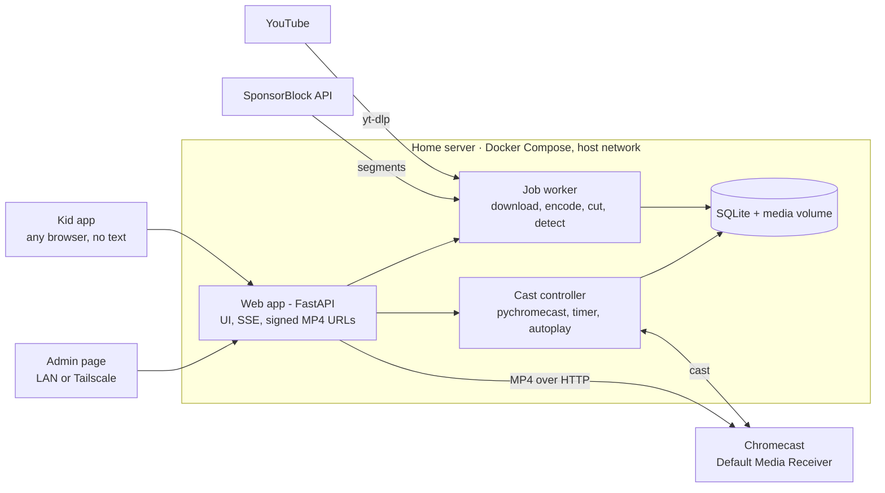

# Tellybox — Product Requirements

_Sep 27, 2026 · Sander · updated Sep 28, 2026 (playlists CI-7, episode and show titles KA-10, interface languages NF-13, SponsorBlock SB-1..6, Cast receiver CR-1..8, phases reordered; Sep 30, 2026: receiver app published, CR-1; Oct 4, 2026: channel subscriptions CS-1..9, inbox sensor HA-9)_

## Overview

Tellybox is a self-hosted web app that lets young children pick parent-approved videos from any device and play them on the TV through a Chromecast, within a daily time allowance the parent controls.

**Problem.** YouTube Kids does not support casting in locked kiosk mode. Casting through the regular YouTube app exposes ads, recommendations and autoplay of unapproved content, and offers no reliable watch-time limit.

**Solution.** The parent adds YouTube videos, playlists or channels on an admin page. The home server downloads approved videos, cuts out sponsor segments using SponsorBlock, optionally splits long compilations into episodes, and serves them on the LAN. Kids choose from a thumbnail-only picker, and the server casts the file to the Chromecast's Default Media Receiver. A timer service tracks watch time per kid and stops playback when the allowance runs out.

### Goals

1. Kids who cannot read can independently choose and start approved content.
2. Nothing plays on the TV that the parent has not explicitly approved: no ads, no sponsor segments, no recommendations, no YouTube app.
3. Each kid's daily viewing time is limited, with parent overrides available from anywhere via Tailscale.
4. Long compilation videos become individual episodes with little manual effort.

### Non-goals

1. Content sources other than YouTube.
2. Policing casts started from other apps or devices.
3. Multi-room playback: Tellybox never plays on several Chromecasts at once. Several TVs may be known, and each profile can have its own default TV (PB-6), but one session plays at a time.
4. Public internet exposure; access is LAN plus Tailscale only.
5. A custom Cast receiver app before v7; the Default Media Receiver stays the fallback even then (CR-6).

## Users and environment

There are two roles: kids, who pick and watch, and a single admin (the parent), who curates content and sets limits.

| Role | Count | Needs | Constraints |
| --- | --- | --- | --- |
| Kid | 2+ (one profile each) | Pick a video, pause/resume, see time left | Cannot read; icon and thumbnail UI only |
| Admin | 1 | Add content, split episodes, set allowances, override the timer, view history | Uses LAN or Tailscale; password login |

### Environment

| Component | Details |
| --- | --- |
| TV receiver | One original Chromecast (no remote). Plays H.264 up to 1080p with AAC audio. |
| TV | Older model; 720p output is sufficient. |
| Kid devices | Any phone, tablet or browser on the home network; no kiosk lock required. |
| Server | Recent Ubuntu, Docker and Docker Compose, CPU-only (no usable GPU). |
| Network | Server and Chromecast on the same LAN segment, so mDNS discovery works. Tailscale provides remote admin access. |
| Deployment | Docker Compose, following the owner's existing deploy-flow repository for this server. |

## Functional requirements: kids, playback and timer

Requirement IDs are referenced in the release plan. Priority: **Must** = required for its release, **Should** = expected but can slip, **Could** = nice to have.

### Profiles

| ID | Requirement | Priority | Release |
| --- | --- | --- | --- |
| PR-1 | Admin creates a profile per kid with a name and a picture (avatar or photo) used for selection. | Must | v2 |
| PR-2 | The kid page starts with a "who's watching" screen showing profile pictures only. More than one profile can be selected for watching together. | Must | v2 |
| PR-3 | Each profile has its own daily allowance (inherit from default, custom or unlimited), usage, continue-watching list and history. Maximum session length is also per-profile (inherit, custom or unlimited) (A-23). | Must | v2 |
| PR-4 | When several profiles watch together, watch time is deducted from each of them, and playback is allowed only while all have time left. | Should | v2 |
| PR-5 | The admin controls which shows each profile can see: a per-profile allow-list of shows (A-37). Episodes inherit from their show. A new show is hidden from every profile until assigned; a new profile starts with no shows, and can be filled once by copying another profile's shows. | Must | v10 |
| PR-6 | When several profiles watch together, the group sees only the shows every selected profile may see (the intersection). | Must | v10 |
| PR-7 | The server enforces visibility on every path, not only in the listing: kid listings, continue watching, playlists (filtered at read time), picks on the TV and in the app, autoplay-next, scoped media URLs and the cast service. A refused pick never moves current playback. | Must | v10 |
| PR-8 | When the admin removes a show from a profile, the episode in progress finishes, autoplay-next stops (for a group, when any member lost access), and the show leaves the grid and continue watching. Positions and history are kept, hidden from the kid app only; granting the show again restores resume. | Must | v10 |

In v1, before profiles exist, a single household profile holds one shared allowance. The data model includes profiles from the start, so v2 needs no migration of history.

Profiles separate time, history and continue watching; which shows a profile sees is set by the admin (PR-5, A-37). There is no PIN: a kid who picks a sibling's picture uses the sibling's time, an accepted risk (A-7).

### Kid app

| ID | Requirement | Priority | Release |
| --- | --- | --- | --- |
| KA-1 | Web app usable on any phone, tablet or desktop browser on the LAN; responsive, touch-first, large tap targets. | Must | v1 |
| KA-2 | No text is required to use the app: navigation uses thumbnails, show artwork and icons only. The short episode and show titles of KA-10 are an aid for adults; nothing depends on reading them. This is the default for every profile; KA-11 is the only exception. | Must | v1 |
| KA-3 | Home screen shows a "continue watching" row, then one tile per show (channel). Tapping a show opens its episode grid in episode order. | Must | v1 |
| KA-4 | Only approved episodes are visible. The kid app has no search, URL entry, or link to the admin page. | Must | v1 |
| KA-5 | Tapping an episode plays it on the TV, or on the device itself when the profile may watch in the app and the device's toggle (KA-13) is set to the device (PB-7). If the profile is already playing something, the new pick replaces it. | Must | v1 |
| KA-6 | A now-playing bar shows the current episode thumbnail and a single pause/resume button. No seek, volume or skip controls. This applies to the TV; in-app playback uses the browser's own video controls, including seeking (KA-14). | Must | v1 |
| KA-7 | All open kid pages reflect the TV's current state live (playing, paused, time's up) within 2 seconds. | Should | v1 |
| KA-8 | Remaining time is shown visually (e.g. a shrinking bar or icons), with a visible change in the last 5 minutes. | Could | v1 |
| KA-9 | When the allowance is used up, the app shows a friendly "time's up" screen and picks are disabled until tomorrow or a parent override. | Must | v1 |
| KA-10 | Episode tiles (episode grid and continue watching) show the episode title in small print below the thumbnail, and show tiles show the show's name below the artwork, cut off after two lines. It helps a parent find the video a kid is describing. The picture stays the main element. The admin shortens a long title by renaming the episode or show (LM-1). | Should | v1 |
| KA-11 | Reader UI, opt-in per profile. The admin can set a profile's kid app style to "text" (default "icons", which is the KA-2 app, unchanged). With "text", the app also shows episode and show titles at full size, the now-playing title and state, the time left today, the name of the TV it plays on, and text on the controls. A device in group mode shows the reader UI only when every selected profile is a reader; otherwise it shows the icon UI, so a child who can't read never gets a text-dependent screen. The picture language stays; text is added, never required. | Should | v8 |
| KA-12 | In the reader UI, a search box on the home screen filters the visible shows and episodes by title. It searches only approved content (KA-4). | Could | v8 |
| KA-13 | A profile the admin has allowed to watch in the app (AD-7) gets a TV/device toggle, a large picture of a TV and of a phone, so it needs no reading. The choice is stored on the device, defaults to the TV, and applies to the next pick. The toggle is hidden when no selected profile may watch in the app; in a group, it is shown only when every selected profile may. | Must | v9 |
| KA-14 | Playing on the device: a pick starts the video full screen with the browser's video controls, seeking included. When the video ends, the next episode of the show plays (PB-3); after the last episode, or when time is up, the library is shown. Leaving full screen returns to the library and ends the session. A video that fails to load shows an error picture and a way back to the library; it does not fall back to the TV. | Must | v9 |
| KA-15 | A profile with no visible shows, or a group whose shared shows are empty (PR-6), gets a picture-only empty state, such as a sleepy TV, with no text and no way to see hidden content. | Must | v10 |

### Playback and casting

| ID | Requirement | Priority | Release |
| --- | --- | --- | --- |
| PB-1 | The server discovers the Chromecast via mDNS and remembers it; the admin can choose it if several are found. | Must | v1 |
| PB-2 | Episodes are cast as MP4 files served over HTTP from the server to the Chromecast's Default Media Receiver; from v7, to the Tellybox receiver, with the Default Media Receiver as fallback (CR-1, CR-6). The YouTube app is never used. | Must | v1 |
| PB-3 | When an episode ends, the next episode of the same show plays automatically, unless time has run out or autoplay is turned off for that show. | Must | v1 |
| PB-4 | Playback position is saved per profile, so "continue watching" resumes where the kid left off. An episode counts as finished at 95% played. | Should | v1 |
| PB-5 | If the Chromecast disconnects or another app takes over, the server records the session as ended and the kid page shows the stopped state. | Must | v1 |
| PB-6 | Each profile can have a default TV (one of the known Chromecasts); without one it uses the globally selected device (PB-1). A pick plays on the picking profile's TV; in a group, the first selected profile's TV. When that differs from the TV in use, what plays there is stopped first, then the pick plays on the new TV (one session at a time). A refused pick (PR-4) never moves playback. The kid app only shows which TV it plays on; it has no TV picker. The only choice it offers is TV or this device (KA-13). | Should | v8 |
| PB-7 | A profile that may watch in the app (AD-7) can play an episode in the kid app itself instead of on the TV (KA-13). The server serves the same MP4 file over a signed, short-lived URL tied to the playing session (NF-3); the browser loads it from the same origin as the page. | Must | v9 |
| PB-8 | Sessions: there is at most one TV session, and each device playing in the app has one session for its selected profiles. A profile is in at most one session. Starting playback for a profile ends its other session, and a session also ends for the others in its group. Different profiles may watch at the same time. Position is saved per profile and resumes on either target (PB-4); an episode counts as finished only at 95% of its length with at least half of its length actually played, so dragging to the end does not finish it. | Must | v9 |
| PB-9 | A playback error in the browser ends the session without counting time, and it is reported to the server. | Should | v9 |

### Watch timer

| ID | Requirement | Priority | Release |
| --- | --- | --- | --- |
| WT-1 | Each profile has a daily allowance in minutes (inherited from default, custom, or unlimited), reset at a configurable time (default 04:00 local) (A-23). | Must | v1 |
| WT-2 | Counting mode is configurable: **ignore pauses** (only playing time counts) or **wall clock** (time counts from play until stop, pauses included). | Must | v1 |
| WT-3 | With "ignore pauses", a per-profile maximum wall-clock session length applies (inherited from default, custom, or unlimited) (A-23). When it's reached, the session ends even if play-time allowance remains. | Must | v1 |
| WT-4 | When the allowance runs out mid-episode, the current episode finishes, then playback stops and autoplay is suppressed. | Must | v1 |
| WT-5 | The finish-the-episode grace is capped (default 15 min) so an unsplit long video cannot run on indefinitely. | Must | v1 |
| WT-6 | Rewatching counts toward the allowance like any other viewing. | Must | v1 |
| WT-7 | Parent overrides from the admin page: grant extra minutes today, set unlimited for today, block viewing for today, and stop playback now. | Must | v1 |
| WT-8 | Timer state survives server restarts; usage is persisted at least every 30 seconds. | Must | v1 |
| WT-9 | Only playback started through Tellybox is timed and controlled; other casts to the Chromecast are ignored. | Must | v1 |
| WT-10 | In-app playback is timed by the server from heartbeats the browser sends about every 10 seconds with its state and position. Time counts only for the interval between heartbeats while the state is playing, and the credit for one heartbeat is capped. After 30 seconds without a heartbeat, time stops counting. After 5 minutes the session ends, and the position is kept up to the last heartbeat. A reported pause is a pause (WT-3's 15-minute rule applies). | Must | v9 |
| WT-11 | In-app playback follows the same limits as the TV: allowance, maximum session length, finish-the-episode grace (WT-4, WT-5), unlimited today, block and stop now. The server enforces them by answering heartbeats and by revoking the session's media URL, so a client that ignores them loses the stream; block and stop now take effect at once. The device shows a time's-up picture (KA-9). | Must | v9 |
| WT-12 | Parent overrides (WT-7) and the admin API (HA-8) act on in-app sessions too, through the cast service. The dashboard and the admin state list every active session with its target (the TV, or the device by a short browser label), and history records the target (AD-4). | Must | v9 |

### Tellybox receiver on the TV

The Default Media Receiver only plays a file and shows its own spinner and backdrop. Tellybox's own Cast receiver adds the kid app's picture language to the TV itself. It shows no text: kids can't read (KA-2).

| ID | Requirement | Priority | Release |
| --- | --- | --- | --- |
| CR-1 | Tellybox has its own Cast Web Receiver. It is published in the Google Cast SDK Developer Console, so it runs on any Chromecast without registering the device; the receiver page is served over HTTPS and contains no household data. It plays the same signed MP4 files as today. | Must | v7 |
| CR-2 | During playback, a small sky in a corner of the TV shows the time left, in the same states as the kid app: the sun sinks, and it's dusk in the last 5 minutes. There's no text and no numbers. It's hidden on an unlimited day. | Must | v7 |
| CR-3 | When the allowance runs out (or on block or stop now) and the episode has ended, the TV shows a night scene instead of the Chromecast backdrop. After 10 minutes the cast session closes, so the TV can go to sleep. | Must | v7 |
| CR-4 | While an episode loads, and between autoplay episodes, the TV shows the show's artwork and the episode's thumbnail instead of a spinner. | Should | v7 |
| CR-5 | In the last seconds before autoplay continues, an up-next card shows the next episode's thumbnail. It isn't shown when time is up, when autoplay is off for the show, or at the end of a show. | Should | v7 |
| CR-6 | If the Tellybox receiver can't launch or load within a few seconds, the cast service falls back to the Default Media Receiver automatically. Timing, control and recognising our own playback (WT-9) work the same with either. | Must | v7 |
| CR-7 | The receiver gets its state (time left, time's up, next episode) from the cast service through a custom Cast message namespace, over the connection the cast service already holds. Apart from loading media and images, it makes no network calls of its own. | Must | v7 |
| CR-8 | On the 1st-gen Chromecast, the overlays don't cause dropped frames or rebuffering in 720p playback. | Must | v7 |

## Functional requirements: admin, content and splitting

The admin page is the only place content enters the system. Nothing reaches the kid app without explicit approval.

### Content ingest

| ID | Requirement | Priority | Release |
| --- | --- | --- | --- |
| CI-1 | Admin pastes a single YouTube video URL; the server fetches its metadata and shows title, channel, duration and thumbnail before download. | Must | v1 |
| CI-2 | Downloads use yt-dlp at a maximum of 720p. Output is MP4 with H.264 video and AAC audio and the faststart flag. Existing H.264 streams are remuxed rather than re-encoded where possible. | Must | v1 |
| CI-3 | Downloads and encodes run as background jobs with visible status (queued, downloading, processing, ready, failed) and a retry action. | Must | v1 |
| CI-4 | By default, videos are grouped into a show named after the YouTube channel. The admin can create, rename and merge shows. | Must | v1 |
| CI-5 | yt-dlp can be updated without rebuilding the app, either automatically on a schedule or from an admin button. | Should | v1 |
| CI-6 | The admin page shows disk usage per show and in total, and the admin can delete a show or episode with its files. | Should | v1 |
| CI-7 | Admin pastes a YouTube playlist URL. The preview lists the playlist's videos with thumbnail, title and duration, and marks videos that are already in the library or unavailable. On confirm, the server creates one download job per remaining video. Each video joins its own channel's show (CI-4). By default the videos are held for approval: they download, but reach the kid app only when the admin publishes them. The add form has a "hold for approval" option, ticked by default for playlists, that the admin can untick. A URL with both a video and a playlist (`watch?v=…&list=…`) asks whether the video or the whole playlist is meant. Channel URLs are not playlists; they stay with subscriptions (CS-1). | Must | v1 |

### SponsorBlock

Sponsor segments are cut out of the file when it's downloaded, using the community database of [SponsorBlock](https://github.com/ajayyy/SponsorBlock). Nothing is skipped during playback: the Default Media Receiver plays a file that simply doesn't contain them.

| ID | Requirement | Priority | Release |
| --- | --- | --- | --- |
| SB-1 | When a video is downloaded, its SponsorBlock segments in the enabled categories are removed from the file (yt-dlp's SponsorBlock support). The lookup sends only a hashed prefix of the video ID. Chapters (ES-1) are shifted to match. | Must | v3 |
| SB-2 | The enabled categories are set in Settings; the default is sponsor, self-promotion and interaction reminders. A show can turn SponsorBlock off or choose its own categories. A change applies to new downloads and to videos still inside their re-check window (SB-3). | Must | v3 |
| SB-3 | For 7 days after a download, the worker checks SponsorBlock daily. If new or changed segments appear in the enabled categories, it downloads the video again with them removed and replaces the file atomically (NF-8). The episode keeps its ID, title, thumbnail, show and hidden state, and saved playback positions are moved back by the time removed before them. | Must | v3 |
| SB-4 | An episode's admin page lists the removed segments (category, original start and end) and the total time removed. It offers "Download again without SponsorBlock" for when a cut removed real content. | Should | v3 |
| SB-5 | If SponsorBlock can't be reached, the download goes ahead uncut, and the re-check window (SB-3) catches up. SponsorBlock never makes a download fail. | Must | v3 |
| SB-6 | Re-checks stop once a video has been split into episodes (ES-8), because the cut points refer to that file. | Must | v5 |

### Channel subscriptions

| ID | Requirement | Priority | Release |
| --- | --- | --- | --- |
| CS-1 | Admin pastes a YouTube channel URL to subscribe. The subscription watches the channel's Videos tab; finished livestreams count, Shorts only if the subscription's "include Shorts" toggle is on (off by default). The existing uploads are listed for selection, paged 30 at a time with "load more"; they are not downloaded automatically. Selected ones go straight to download; unselected ones never become inbox items. The moment of subscribing is a baseline: only later uploads are new (A-31, A-32). | Must | v4 |
| CS-2 | The server checks subscribed channels for new uploads on a schedule: one global interval in the settings, default every 6 hours, minimum 1 hour. "Check now" runs a check for one subscription or for all. A check lists the channel's newest 30 uploads and stops at the first video it has already seen; if all 30 are new it pages on, up to 100, and logs a warning if that cap is reached. | Must | v4 |
| CS-3 | New uploads go to an approval inbox showing thumbnail, title and duration. Only approved items are downloaded. Approving is the one decision: the video downloads and is published when ready, with no second "hold" step (A-33). There is no automatic approval, not even per channel (A-9). A compilation that automatic detection picks up stays hidden as in A-22. | Must | v4 |
| CS-4 | Subscriptions can be paused or removed without deleting downloaded content. Pausing keeps the inbox visible and actionable; on resume, uploads made during the pause are found. Removing deletes the subscription's pending items, keeps rejection records, and leaves the show and its episodes in place (A-6); subscribing again starts from a fresh baseline. | Should | v4 |
| CS-5 | A check skips a video silently when it is already in the library, already pending or already rejected (by YouTube ID). An upcoming premiere or live stream makes no item until it is a normal video. A members-only or age-restricted video makes an item marked "may not be downloadable"; if approved, its download job fails visibly and can be retried (CI-3). Same-title re-uploads are not detected. | Must | v4 |
| CS-6 | An inbox item is pending, approved or rejected. There is no snooze and nothing expires. Rejections are remembered and can be undone from a "Rejected" tab. The inbox supports multi-select with bulk approve and bulk reject, and "reject all remaining" (A-34). | Must | v4 |
| CS-7 | Each subscription shows when it was last checked and its last error. A failed check retries on the normal schedule, without limit, and never affects existing content. After 7 days of consecutive failures the subscription shows a warning badge. There are no push alerts (A-35). | Should | v4 |
| CS-8 | "Subscriptions" and "Inbox" are separate admin pages; the Inbox nav entry carries the pending count, updated live. The inbox lists newest first, with a channel filter. Each card shows thumbnail, title, duration, channel, published date and an "Open on YouTube" link; there is no embedded player. | Must | v4 |
| CS-9 | Approved uploads join the channel's show (CI-4), or the existing show the admin chose when subscribing. The subscription keeps a reference to that show, so renaming or merging it is followed. There are no duration or title filters; the admin judges every upload. | Must | v4 |

### Library management

| ID | Requirement | Priority | Release |
| --- | --- | --- | --- |
| LM-1 | Admin can rename shows and episodes, reorder episodes, and move episodes between shows. | Must | v1 |
| LM-2 | Admin can set a show's artwork and an episode's thumbnail, by uploading an image or picking a frame from the video. | Should | v1 |
| LM-3 | Admin can hide or unhide shows and episodes from the kid app without deleting them. | Must | v1 |
| LM-4 | Per-show settings: autoplay on or off, and the show's splitting profile (see below). | Must | v1 |

### Episode splitting

Every split is proposed first and must be reviewed and approved by the admin before episodes are published.

| ID | Requirement | Priority | Release |
| --- | --- | --- | --- |
| ES-1 | If the YouTube video has chapters, they are offered as proposed split points with their titles. | Should | v5 |
| ES-2 | Manual splitting: in a scrub-able player, the admin marks cut points and names each resulting episode. | Must | v5 |
| ES-3 | Title-card marking: the admin scrubs to a title screen, selects it and optionally draws a region to compare (e.g. the logo area). The marking is saved to the show's splitting profile. | Must | v6 |
| ES-4 | Title-card detection: using the show's profile, the server samples frames (about 2 fps) and proposes a cut wherever a title card appears. | Must | v6 |
| ES-5 | Episode-length hint: the admin enters an approximate episode length. Detection uses it to reject hits too close together, and to search harder near expected boundaries when a title card is missed. | Must | v6 |
| ES-6 | Cut placement: each cut snaps to the nearest scene change or black frame shortly before the title card, if one is found within a configurable window (default 30 s). Otherwise it falls back to the title card itself. | Should | v6 |
| ES-7 | Review screen: a thumbnail strip at each proposed cut with the start frame and timestamp. The admin can nudge, add or delete cuts, rename episodes and approve. | Must | v5 |
| ES-8 | On approval, episodes are cut frame-accurately (re-encoded) into separate files, and the source file is optionally deleted. | Must | v5 |
| ES-9 | OCR reads the episode title from the title card to prefill episode names. | Could | v6 |
| ES-10 | New compilations for a show with a saved profile are detected automatically after download and wait in the review queue. | Should | v6 |

### Admin, settings and history

| ID | Requirement | Priority | Release |
| --- | --- | --- | --- |
| AD-1 | Admin pages require a password; sessions expire after 30 days of inactivity. | Must | v1 |
| AD-2 | Settings page: allowance per profile (inherit/custom/unlimited) and maximum session length (inherit/custom/unlimited), counting mode, household default limits, kid app style and default TV per profile (KA-11, PB-6), reset time, grace cap and selected Chromecast (A-23). | Must | v1 |
| AD-3 | Dashboard: now playing, time used and remaining per profile, override buttons (WT-7) and job status. It must be usable on a phone. | Must | v1 |
| AD-4 | Viewing history per profile: episode, start and end time, minutes counted, and overrides applied. | Must | v1 |
| AD-5 | History older than 21 days is purged automatically. | Must | v1 |
| AD-6 | Optionally, the admin signs in with an OpenID Connect provider instead of the password; only members of one configured group are admitted, and the password stays available. | Should | — |
| AD-7 | Per profile, the admin can allow watching in the app (default off). When off, the profile only plays on the TV and the toggle (KA-13) is hidden. | Must | v9 |
| AD-8 | A show-access page shows a show x profile matrix of ticks, usable on a phone; the show's settings carry a "Visible to" checklist. Approving from the inbox (CS-*) or adding by URL offers an optional profile checklist, with none selected by default. Creating a profile offers "copy shows from" another profile, as a one-off copy. | Must | v10 |
| AD-9 | The dashboard flags a profile that has no visible shows. | Should | v10 |

### Admin API (Home Assistant)

A token-authenticated JSON API lets a home-automation system (first Home Assistant) show Tellybox's live state and apply the parent overrides. It never becomes a way around the timer. Contract: `docs/admin-api.md`.

| ID | Requirement | Priority | Release |
| --- | --- | --- | --- |
| HA-1 | The admin creates, names and revokes long-lived API tokens with a `read` or `read + control` scope; a token is shown once and only its hash is stored. | Must | v2.1 |
| HA-2 | With a read token, the admin state is available as JSON in absolute units: now playing, per-profile allowance, extra, used and remaining time, session and grace, time up, TV reachability, job counts and disk use. | Must | v2.1 |
| HA-3 | The same state streams as server-sent events on every change, with a keepalive. | Must | v2.1 |
| HA-4 | With a control token, the overrides of WT-7 (extra minutes, unlimited today, block today, stop now) can be applied for everyone or for chosen profiles, through the same code path as the admin dashboard. | Must | v2.1 |
| HA-5 | Today's unlimited and block can be cleared through the API; extra minutes stay. | Should | v2.1 |
| HA-6 | Each installation has a stable instance id; an unauthenticated info endpoint gives the instance id, version and capabilities. | Must | v2.1 |
| HA-7 | Overrides applied through the API are recorded with the token's name, and the history shows it. | Should | v2.1 |
| HA-8 | Every API action goes through Tellybox's cast service; the API offers no way to cast directly or to start playback when time is up. | Must | v2.1 |
| HA-9 | The admin state carries an inbox object: `pending` (items waiting in the subscription inbox, paused subscriptions included), `unhealthy` (subscriptions with the 7-day failure warning of CS-7) and `latest_received_at` (when the newest inbox item arrived, null if none, so an automation can fire on every new upload). `/api/info` lists an `inbox` capability. It is read-only, filled by the web service from the database without the cast service, and outside HA-8 (A-36). | Must | v4 |
| HA-10 | The admin state lists the number of visible shows per profile, read-only, so an automation can alert on zero. There are no endpoints to change assignments. It is filled by the web service from the database and is outside HA-8, like HA-9. | Should | v10 |

### Installation

Installing Tellybox takes one compose file and one settings file, on any Linux server or home-server platform with host networking. Added by the owner on 2026-10-02 (step 15), from the "Simplifying Tellybox deployment" review.

| ID | Requirement | Priority | Release |
| --- | --- | --- | --- |
| DP-1 | Releases publish a versioned image (`X.Y.Z`, `X.Y`, `latest`) for amd64 and arm64; the main branch publishes `edge`. | Must | 15 |
| DP-2 | Each release attaches a ready-made compose file and a commented settings file (`.env`); installing means downloading both, setting the time zone and starting it. | Must | 15 |
| DP-3 | The container fixes the ownership of its data, media and backup folders at start and then drops root; `PUID`/`PGID` choose the user. No manual `chown`. | Must | 15 |
| DP-4 | Without a configured admin password, the first visit to the admin sets one, guarded by a one-time setup code printed in the logs. An environment password still wins. | Must | 15 |
| DP-5 | One container runs web, cast and worker by default; the three separate services stay supported. | Must | 15 |
| DP-6 | An install script sets up a plain Linux server with Docker in one command. | Should | 15 |
| DP-7 | A Home Assistant add-on installs Tellybox on Home Assistant OS. | Should | 15 |
| DP-8 | Templates for Unraid, TrueNAS SCALE, CasaOS and Umbrel, and a guide for Synology. | Could | 15 |

## Non-functional requirements

The system must run unattended on a CPU-only home server and recover on its own from restarts and network blips.

| ID | Area | Requirement |
| --- | --- | --- |
| NF-1 | Security | The kid app is reachable on the LAN and via Tailscale without login, but exposes only approved content and playback of it. |
| NF-2 | Security | Admin endpoints are authenticated server-side; the admin password is stored as a salted hash (argon2 or bcrypt). |
| NF-3 | Security | Media file URLs given to the Chromecast are unguessable and expire (signed tokens), because the Chromecast cannot authenticate. |
| NF-4 | Security | Nothing is exposed to the public internet; no ports are forwarded. |
| NF-5 | Performance | A tap in the kid app starts playback on the TV within 5 seconds. |
| NF-6 | Performance | On CPU only, a 720p encode runs at least as fast as real time (x264 `veryfast` preset or similar), and title-card detection takes under half the video's duration. |
| NF-7 | Reliability | After a restart, the server reconnects to the Chromecast, restores timer state and resumes queued jobs within 60 seconds. |
| NF-8 | Reliability | Failed downloads or encodes never publish partial files; they can be retried from the admin page. |
| NF-9 | Storage | Media, database and config live on mounted volumes. A single SQLite file holds all state, so backup means copying one file. |
| NF-10 | Deployment | Ships as one container (or a Docker Compose stack of three services) using host networking (required for mDNS discovery). The owner's server is deployed through the owner's existing deploy-flow repository. |
| NF-11 | Operations | Structured logs to stdout. Admin dashboard shows job failures and Chromecast connection status. |
| NF-12 | Usability | Admin pages work on a phone screen. Kid pages work on screens from 4.7" phones to desktop. |
| NF-13 | Usability | The interface is in English, Dutch or German, chosen per browser from its language preferences (Accept-Language, `navigator.languages`), with English as the fallback. It covers all admin text and the kid app's screen-reader labels; content titles are not translated. |

## Architecture and data model

One Docker Compose stack on the home server runs three services that share a SQLite database and a media volume. The Chromecast only ever pulls MP4 files from the server; it never talks to YouTube.

The cast controller is the single owner of the Chromecast connection and the timer. The web app sends it commands (play, pause, override), and it pushes state changes back to all open pages.

**Stack.** Python 3 with FastAPI, pychromecast, yt-dlp, ffmpeg (including its scene and black-frame detection), OpenCV (with our own dHash); Tesseract optional for OCR. Frontend is a lightweight server-rendered or small SPA app, installable as a home-screen web app.

### Data model

| Entity | Key fields | Notes |
| --- | --- | --- |
| Profile | name, picture, daily allowance (inherit/custom/unlimited), maximum session length (inherit/custom/unlimited), counting mode, UI mode (icons or text, KA-11), default TV (PB-6), may watch in the app (AD-7), allowed shows (PR-5) | v1 has one household profile; limits per-profile from v2 (A-23); UI mode defaults to icons, default TV to none (the global device) |
| Show | name, artwork, autoplay, sort order, splitting profile, SponsorBlock categories | Defaults to one per YouTube channel; categories not set = the global setting, none = SponsorBlock off for the show (SB-2) |
| SourceVideo | YouTube ID, channel, title, duration, file path, status, removed segments, SponsorBlock re-check until | The downloaded original; may be deleted after splitting |
| Episode | show, source video, start/end offset, title, thumbnail, file path, order, hidden | What kids see and play |
| SplitProfile | reference frames, compare region, match threshold, length hint, snap window | One per show |
| SplitProposal | source video, proposed cuts, status | Waits for admin review |
| Job | type, target, status, progress, error, attempts | Download, encode, detect, cut |
| Subscription | channel ID, channel name, show, include Shorts, paused, baseline, last checked, last error, failing since | v4; the check interval is a global setting |
| InboxItem | subscription (kept empty after removal), YouTube ID, metadata, published date, warning, status (pending, approved, rejected), received, decided | v4 approval inbox; rejected rows outlive their subscription (A-34) |
| WatchSession | profiles, episode, started, ended, seconds counted | History; purged after 21 days |
| DailyUsage | profile, date, seconds used, extra minutes, blocked | Timer state |
| PlaybackPosition | profile, episode, position, finished | Continue watching |

## Release plan

v1 delivers a complete, usable loop for the whole family; it shipped on 2026-09-28, including playlists, titles on tiles and interface languages. The owner reordered what follows on 2026-09-28: per-kid profiles first, then SponsorBlock, channel subscriptions, manual splitting, smart splitting, and finally Tellybox's own Cast receiver. On 2026-09-29 the owner moved the receiver (v7) ahead of v3–v6. Each requirement's release is listed in its table above.

| Phase | Scope | Gate to next phase |
| --- | --- | --- |
| v1 · Core loop | Kid picker (one profile), cast MP4, timer with grace cap and overrides, add by URL or playlist, download and encode, history with 21-day purge, English/Dutch/German | Shipped 2026-09-28 |
| v2 · Kid profiles | "Who's watching" screen, per-kid allowance, usage, continue watching and history, watching together (PR-1..4) | Real-device checks pass; a week of daily use |
| v2.1 · Admin API | API tokens, admin state and events, overrides over JSON, instance id: the Tellybox side of a Home Assistant integration (HA-1..8) | Running at home for a week before the integration builds on it |
| v3 · SponsorBlock | Cut sponsor segments at download, categories per show, 7-day re-check (SB-1..5) | Real-device checks pass |
| v4 · Channel subscriptions | Subscribe to a channel, scheduled checks, approval inbox (CS-1..4) | Real-device checks pass |
| v5 · Manual splitting | Scrub player, cut marking, chapter import, review screen, frame-accurate cutting (ES-1, ES-2, ES-7, ES-8, SB-6) | Real-device checks pass |
| v6 · Smart splitting | Title-card marking and detection, length hint, scene snap, OCR titles, automatic detection for new compilations (ES-3..6, ES-9, ES-10) | Detection accepted on 2 shows |
| v7 · Tellybox receiver | Own Cast receiver: time left on the TV, time's-up screen, loading and idle screens, up-next card, automatic fallback to the Default Media Receiver (CR-1..8) | Real-device checks pass on the 1st-gen Chromecast |
| v9 · Watching in the app | Play in the kid app on the device itself: TV/device toggle, full screen, heartbeat-timed with server-enforced limits, several sessions at once (KA-13, KA-14, PB-7..PB-9, WT-10..WT-12, AD-7) | Real-device checks pass on the Chromecast, an iPhone and an Android phone |
| v10 · Show access per profile | Per-profile allow-list of shows, intersection for groups, server-side enforcement, admin matrix, empty state (PR-5..PR-8, KA-15, AD-8, AD-9, HA-10) | Real-device checks pass |

### v1 build order

1. **Casting spike.** Discover the Chromecast from a container with host networking and cast a local MP4 served over HTTP; confirm pause, resume and status events.
2. **Cast controller and timer.** Persistent session, play-time accounting in both counting modes, grace cap, session maximum, overrides, restart recovery.
3. **Ingest pipeline.** yt-dlp download at 720p, remux or encode to H.264/AAC, job queue with status and retries.
4. **Kid app.** Show grid, continue watching, episode grid, now-playing bar, time's-up screen, live updates.
5. **Admin pages.** Login, add by URL, library management, settings, dashboard with overrides, history.
6. **Deployment.** Compose file and integration with the existing deploy-flow repository; volume and backup setup. (Moved ahead of splitting by the owner, 2026-09-28: deploy before adding features.)
7. **Playlists and episode titles.** Add a playlist as one job per video, held for approval by default (CI-7); short episode titles on the kid app's episode tiles (KA-10). (Added by the owner, 2026-09-28, ahead of splitting.)

### Build order after v1

One step per branch or PR, each proposed as a plan first and closed with real-device checks.

8. **Kid profiles (v2).** Profile management, "who's watching" screen, per-profile timer and history, watching together.
9. **Admin API for Home Assistant (v2.1).** API tokens, the admin state and its event stream, override endpoints, instance id and `/api/info` (HA-1..HA-8). Phase 0 of the owner's Home Assistant integration plan; the integration itself lives in separate repositories. (Inserted by the owner, 2026-09-29. Plan: `docs/plans/step9-ha-api.md`.)
10. **SponsorBlock (v3).** Cutting at download, settings and per-show categories, the 7-day re-check with position adjustment, removed-segment overview.
11. **Channel subscriptions (v4).** Subscribe, list existing uploads, scheduled checks, approval inbox, pause and remove, and a Home Assistant inbox sensor (CS-1..9, HA-9). (Plan: `docs/plans/step11-subscriptions.md`.)
12. **Manual splitting (v5).** Scrub player, cut marking, chapter import, review screen, frame-accurate cutting.
13. **Tellybox receiver (v7).** It starts with a spike on the real 1st-gen Chromecast: registration, where the receiver is hosted, and overlay performance. Then come the fallback, the time-left sky, the time's-up screen, the loading screens and the up-next card. (Moved ahead of SponsorBlock, subscriptions and splitting by the owner, 2026-09-29: the TV is where the kids look. Plan: `docs/plans/step13-receiver.md`.)
14. **Smart splitting (v6).** Title-card marking and detection, length hint, scene snap, OCR titles, automatic detection. (Renumbered from 12 when the admin API was inserted as step 9 and the receiver kept 13, 2026-09-29.)
15. **Easier installation.** Versioned multi-arch images, a release compose file, no manual prep, a first-run password, a single container, an install script, a Home Assistant add-on and platform templates (DP-1..DP-8). (Added by the owner, 2026-10-02, and built before 11. Plan: `docs/plans/step15-installation.md`.)
16. **Reader UI and per-profile TV (v8).** A text-rich kid app that the admin switches on per profile (KA-11, KA-12), and a default TV per profile (PB-6). The no-text app stays the default (KA-2). (Added from GitHub issue #29, 2026-10-02.)
17. **Watching in the app (v9).** Play episodes in the kid app on the device itself, with a per-device TV/device toggle and an admin switch per profile (KA-13, KA-14, PB-7..PB-9, WT-10..WT-12, AD-7). Two PRs: first the cast controller handles several sessions with no visible change, then the browser player. (Added from GitHub issue #31, 2026-10-04; plan: `docs/plans/step17-in-app-playback.md`.)
18. **Show access per profile (v10).** An admin-managed allow-list of shows per profile, enforced on the server on every path, with a show x profile matrix and a picture-only empty state (PR-5..PR-8, KA-15, AD-8, AD-9, HA-10). It supersedes A-8. (Added from GitHub issue #40, 2026-10-05; plan: `docs/plans/step18-profile-show-access.md`.)

## Risks, assumptions and open questions

The biggest risks are external: YouTube changes that break yt-dlp, and the ageing original Chromecast. Both are cheap to test early in the v1 casting spike.

### Risks

| Risk | Impact | Mitigation |
| --- | --- | --- |
| YouTube changes break yt-dlp downloads | New content can't be added; existing library unaffected | Update yt-dlp without rebuilding (CI-5); retry failed jobs |
| Downloading may conflict with YouTube's terms of service | Policy risk for the owner | Personal household use only, no redistribution; owner accepts the risk |
| The original Chromecast no longer receives Google software updates | Casting behaviour could change or break | Use only the standard Default Media Receiver; verify in step 1 of v1 |
| CPU-only encoding of long compilations is slow | Content availability delayed by hours | Remux when possible, x264 `veryfast`, low-priority background jobs |
| The kid app has no login, so a kid can pick a sibling's profile | One kid uses another's allowance | Accepted: no PIN (A-7). Revisit if it's abused. |
| A new show stays invisible until the admin assigns it | A kid sees nothing new, and the admin wonders why | The inbox approval and add-by-URL forms offer the profile checklist (AD-8); the dashboard flags profiles with no shows (AD-9) |
| SponsorBlock segments are community-submitted and can be wrong | Real content is cut out | Only sponsor, self-promotion and interaction by default; per-show opt-out; the removed segments are visible, with "Download again without SponsorBlock" (SB-2, SB-4) |
| Segments are submitted after the download | Sponsor parts stay in the file | Daily re-check for 7 days (SB-3) |
| Title-card detection accuracy varies per show | Wrong or missed cuts | Mandatory review (ES-7), manual cuts as fallback, per-show tuning |
| mDNS discovery fails inside Docker | Chromecast not found | Host networking (NF-10); manual IP entry as fallback |
| The Chromecast loads a custom receiver from an HTTPS URL, but it can't resolve internal names (it uses its own DNS) | The receiver can't be hosted on the home server as-is | Spike first in v7. Options: a public static host for the receiver's HTML and JS, which contain no household data (media still comes from the LAN), or a public DNS name with a valid certificate that points at the LAN. Decide in the spike (open question). |
| An HTTPS receiver page loads media over plain HTTP from the LAN | Mixed-content blocking on the receiver | Test in the v7 spike; serve media over HTTPS on the LAN if needed |
| Overlays are too heavy for the 1st-gen Chromecast | Stutter during playback | Keep overlays static, CSS-only and small (CR-8); measure in the spike |
| Google changes the Cast SDK or the developer-console rules | The receiver stops loading | Automatic fallback to the Default Media Receiver (CR-6) |

### Assumptions

| ID | Assumption |
| --- | --- |
| A-1 | Watching together deducts time from every selected profile (PR-4). |
| A-2 | "Ignore pauses" counts only playing time, capped by a maximum wall-clock session length (WT-2, WT-3). |
| A-3 | The daily allowance resets at 04:00 local time. |
| A-4 | The finish-the-episode grace is capped at 15 minutes. |
| A-5 | A new pick in the kid app replaces what is playing, rather than being queued. |
| A-6 | Removing a subscription keeps its downloaded episodes. |
| A-7 | Kid profiles have no PIN or other protection (owner, 2026-09-28). |
| A-8 | Superseded by A-37. Originally every profile saw the whole approved library (owner, 2026-09-28). |
| A-9 | Subscription uploads always go through the approval inbox; there is no auto-approve (owner, 2026-09-28). |
| A-10 | SponsorBlock segments are removed from the file at download rather than skipped during playback; default categories are sponsor, self-promotion and interaction reminders (owner, 2026-09-28). |
| A-11 | The Tellybox receiver (v7) covers time left on the TV, the time's-up screen, loading and idle screens and the up-next card; the Default Media Receiver stays as an automatic fallback (owner, 2026-09-28). |
| A-12 | Each device remembers who's watching; it asks again after the daily reset or 30 minutes without use, and an avatar button switches kids at any time (owner, 2026-09-29). |
| A-13 | The maximum session length (WT-3) applies per profile: each kid has their own viewing session and break (owner, 2026-09-29). |
| A-14 | A profile picture is a built-in avatar or an uploaded photo (owner, 2026-09-29). |
| A-15 | The v1 household profile becomes the first kid's profile (renamed by the admin) and keeps its history; profiles can be deleted, except the last one (owner, 2026-09-29). |
| A-16 | API tokens are independent of the admin password: changing the password doesn't revoke them. Revoked tokens stay listed (owner, 2026-09-29). |
| A-17 | Extra minutes through the API are capped at 240 per call, with no daily cap: a control token carries the parent's authority (owner, 2026-09-29). |
| A-18 | The kid app doesn't show where an override came from (owner, 2026-09-29). |
| A-19 | SponsorBlock cuts are made at keyframes by yt-dlp (stream copy), without re-encoding. A cut may be off by up to about two seconds (owner, 2026-09-30). |
| A-20 | Videos downloaded before v3 are not cut by the daily re-check; the admin can download one again with SponsorBlock from its episode page (step 10, 2026-09-30). |
| A-21 | After a split, the source file is kept unless the admin ticks "delete the original video after cutting" when approving (unticked by default). A kept source can be split again (owner, 2026-10-01). |
| A-22 | A compilation that automatic detection (ES-10) picks up stays hidden from the kid app until its split is approved, or the admin publishes it whole (owner, 2026-10-01). |
| A-23 | Per-profile limits (daily allowance and maximum session length): each limit mode is inherit (use the household default), custom (profile-specific value), or unlimited (no limit). Existing profiles were migrated to custom mode. Counting mode, grace cap, session break, and extra minutes work the same whether limits are inherited, custom or unlimited. Extra minutes are ignored if a profile is unlimited (issue #27, 2026-10-02). |
| A-24 | OIDC sign-in (AD-6) is an extra way into the admin, never the only one: the password stays, so the admin is reachable while the provider is down (owner, 2026-10-02, issue #28). |
| A-25 | First-run setup (DP-4) is unchanged with OIDC configured: without a password, every admin page goes to the setup page. OIDC sign-in works once a password exists (owner, 2026-10-02). |
| A-26 | Only members of one group (`TELLYBOX_OIDC_ADMIN_GROUP`) are admitted, and the group is the single admin. OIDC configured without a group stops the services from starting, rather than letting every account at the provider in (owner, 2026-10-02). |
| A-27 | OIDC is configured through environment variables only, including an explicit redirect URI; nothing is in the settings page. The sign-in page shows one "Sign in with OIDC" button, without a provider name or logo (owner, 2026-10-02). |
| A-28 | An OIDC sign-in creates the same admin session as the password (AD-1): 30 days sliding, ended by sign-out or a changed environment password. Sign-out is local; there is no sign-out at the provider. A sign-in only completes in the browser that started it. API tokens are unaffected (A-16) (owner, 2026-10-02). |
| A-29 | In-app playback (step 17, issue #31): the server cannot see the browser, so it trusts heartbeats within caps and revokes the media URL when a limit is reached. A kid who blocks heartbeats loses the stream at the end of the URL's lifetime. Seeking is allowed; it cannot create free time, and it cannot finish an episode (PB-8). Autoplay applies as on the TV (owner, 2026-10-04). |
| A-30 | A profile playing on a device and on the TV at once is impossible by design (PB-8); two profiles may play at once, one per target. A group's session ends together (owner, 2026-10-04). |
| A-31 | A subscription watches a channel's Videos tab. Shorts are included only when the subscription's toggle is on (off by default). Livestreams count once they have finished (owner, 2026-10-04). |
| A-32 | A subscription has a baseline from the moment it is created: the videos the channel already lists, remembered by YouTube ID. Only uploads after it become inbox items; backlog videos the admin doesn't select at subscribe time never do. Subscribing again starts a fresh baseline (owner, 2026-10-04). |
| A-33 | Approving an inbox item downloads it and publishes it when ready. Unlike playlists (CI-7), there is no second "held" step (owner, 2026-10-04). |
| A-34 | Rejected videos are remembered by YouTube ID, so a check never proposes them again, also after the subscription is removed and added again. A rejection can be undone from the inbox's "Rejected" tab. Inbox items never expire (owner, 2026-10-04). |
| A-35 | A failing subscription keeps retrying on the normal schedule and is never paused automatically. It shows its last error, and a warning after 7 days of failures. There are no push alerts (owner, 2026-10-04). |
| A-36 | The inbox sensor (HA-9) is read-only: no approve or reject through the API. It is filled by the web service, not the cast service, so HA-8 doesn't cover it and it still answers when the cast service is down (owner, 2026-10-04). |
| A-37 | Each profile has an allow-list of shows (issue #40). New shows and new profiles start with nothing visible; assigning is a deliberate admin action. The upgrade grants every existing profile every existing show, so nothing changes on upgrade. Groups see the intersection (PR-6). Visibility is by show only, with no ratings or per-episode control, and read-only in the admin API (HA-10). It supersedes A-8 (owner, 2026-10-05). |

### Open questions

- ☑ Should each kid profile be protected with a picture PIN? No, not for now (A-7).
- ☐ Should the wall-clock limit apply per session, or also as allowed viewing hours in the day (e.g. 16:00 to 18:30)?
- ☑ Should the source compilation file be kept after splitting, for re-cutting later, or deleted to save space? The admin chooses per split; kept by default (A-21).
- ☐ Where is the Tellybox receiver hosted so the Chromecast can load it over HTTPS (v7 spike)?
- ☑ Which conventions from the deploy-flow repository apply? Settled in step 6 (the owner's private runbook; `docs/installation.md` is the general guide).
